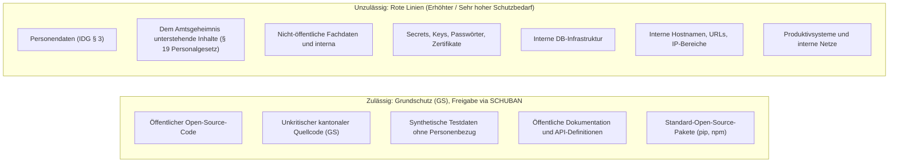
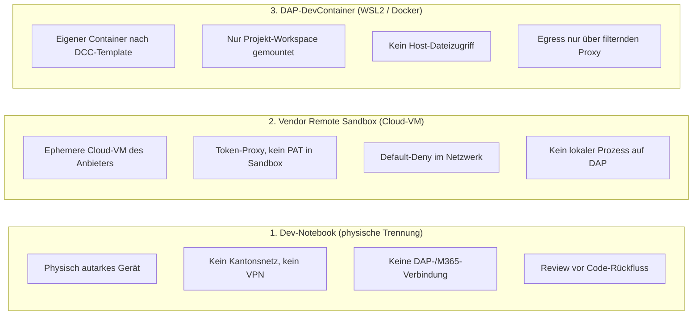
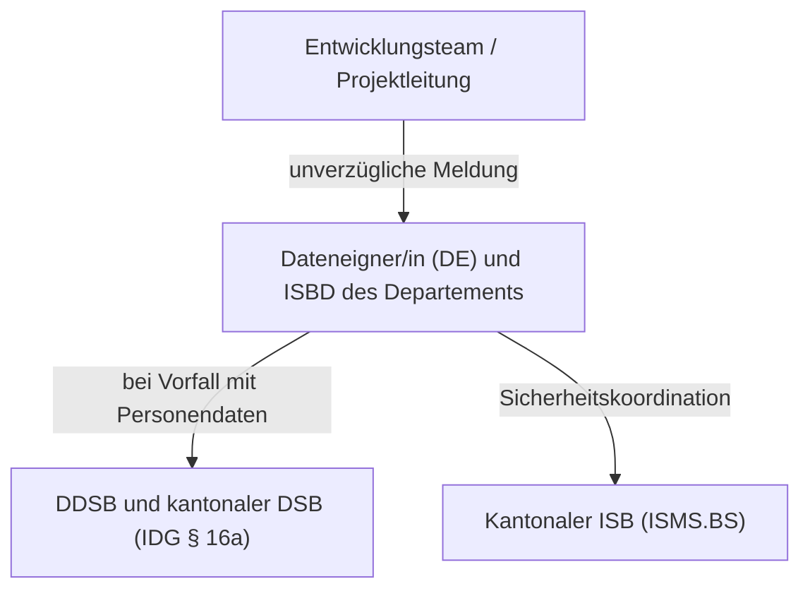

# Leitfaden: KI-Coding-Agents in der Softwareentwicklung sicher einsetzen

Dieser Leitfaden ist die Referenzimplementierung des DCC Data Competence Center am Statistischen Amt Basel-Stadt zur Richtlinie «Einsatz von KI-Agenten in der Softwareentwicklung». Andere kantonale Stellen passen die Umsetzung an ihre Rahmenbedingungen an. Die Mindestanforderungen (Abschnitt 4 und 6) sowie die Roten Linien gelten kantonsweit.

Der Leitfaden regelt ausschliesslich freigegebene KI-Coding-Agents für Softwareentwicklungsaufgaben. Andere KI-Agenten mit Computer-, Browser- oder allgemeinem Systemzugriff bleiben verboten.

Der allgemeine Software-Engineering-Prozess ist nicht Gegenstand dieses Leitfadens. Code Review, Testtiefe, Vier-Augen-Prinzip und die Ausgestaltung der CI/CD verbleiben in der Verantwortung der jeweiligen Dienststelle.

---

## 1. Zweck und Geltungsbereich

KI-Coding-Agent. Ein Werkzeug, das auf einem Sprachmodell beruht und im Namen von Entwickelnden Aktionen ausführt und Werkzeuge bedient. Coding-Agents interpretieren den Zustand einer Codebasis, passen ihn an und führen eigenständig Handlungen aus: Dateien lesen und schreiben, Shell-Befehle ausführen, Tests starten, Abhängigkeiten beziehen, mit der Codeverwaltung interagieren und kontrollierte Netzwerkzugriffe durchführen. Beispiele sind Claude Code, OpenAI Codex CLI und GitHub Copilot Agent Mode.

Reine Autocomplete- und Inline-Vervollständigungen sowie IDE-Chats ohne eigenständigen Shell-, Werkzeug- oder Netzwerkzugriff fallen nicht unter diesen Leitfaden.

### Grundbegriffe

Ein **kantonsexternes KI-System** verarbeitet Eingaben, Kontext oder Tool-Ergebnisse ausserhalb der kantonalen Infrastruktur (z. B. Anthropic- oder OpenAI-APIs).

Das **Einsatzprofil** beschreibt die geprüfte Kombination aus Produkt, Konfiguration, Ausführungsumgebung, Datei- und Netzwerkrechten und Verwendungszweck.

**Erweiterungen** wie MCP-Server, Plugins und Hooks laufen ausserhalb der einfachen Shell-Kapselung. Sie bieten zusätzliche Systemfunktionen und bleiben standardmässig deaktiviert.

**Inhalte** wie Skills und Subagenten umfassen textuelle Instruktionen (Markdown, Systemprompts, Skripte). Sie unterliegen denselben Systemgrenzen wie der Agent, gewähren keine Zusatzrechte, bilden aber Angriffsvektoren für Prompt Injection.

---

## 2. Grundsatz und Bedrohungsmodell

Modelle können Prompt Injection nicht zuverlässig verhindern [1]. Weder Systemprompts noch Bestätigungsdialoge bieten verlässliche Sicherheit. Die Ausführungsumgebung muss technisch verhindern, dass ein manipulierter Agent sensible Ressourcen erreicht. Freigegeben wird stets das vollständige Einsatzprofil, nie ein einzelnes Werkzeug.

### Bedrohungsmodell

Das Bedrohungsmodell orientiert sich an der gemeinsamen Empfehlung internationaler Sicherheitsbehörden [2] und  an der OWASP-Sammlung zur Sicherheit von KI-Agenten [3].

Bei einer indirekten Prompt Injection steuern manipulierte Anweisungen in Fremdcode, Dokumentationen, Tickets oder Webseiten den Agenten fern. Dagegen wirken strikte Isolation, fehlender Zugriff auf interne Netze oder Secrets sowie die menschliche Prüfung.

Bei einer Datenexfiltration liest der Agent vertrauliche Dateien und überträgt sie über Modellprompts oder Netzwerkverbindungen. Die primäre Kontrolle ist die Datenschranke (Abschnitt 4), da die Verbindung zum Modellanbieter systembedingt offen bleiben muss. Mount-Grenzen und Egress-Filter begrenzen den Abfluss ausserhalb des Workspace.

Bei einer Privilege Escalation bricht der Agent aus dem Workspace auf den Arbeitsplatz aus. Dem begegnen Container-Kapselung, unprivilegierte Benutzer und der Verzicht auf Host-Credentials.

Bei Lieferkettenangriffen installiert der Agent manipulierte oder halluzinierte Pakete. Dagegen schützen Allowlists für Paketquellen und die manuelle Prüfung vor der Integration.

Bei einer Manipulation der Freigabe (Approval Manipulation) erschleichen geschönte Zusammenfassungen, irreführende Commits oder unübersichtliche Diffs die Zustimmung der Entwickelnden [3]. Dagegen hilft nur die Prüfung des vollständigen Diffs im Repository statt der Agenten-Zusammenfassung sowie die Einzelbestätigung kritischer Aktionen.

### Verbleibendes Risiko und Erkennung

Die Verbindung zum Modellanbieter bleibt in allen Architekturen offen. Selbst ohne allgemeinen Netzzugriff kann der Agent Daten über Modellprompts übertragen [9]. Die Datenschranke (Abschnitt 4) ist daher die primäre Kontrolle: Im Kontext des Agenten dürfen ausschliesslich öffentliche oder als Grundschutz (GS) klassifizierte Inhalte liegen.

Für die Erkennung von Auffälligkeiten stützt sich der Leitfaden auf die bestehenden Sicherheitssysteme und Überwachungsprozesse der kantonalen IT. Eigene Detektionsmechanismen für Agenten-Sitzungen werden vorerst nicht aufgebaut (zum Ausbau siehe Abschnitt 8).

---

## 3. Governance und Verantwortlichkeiten

Die formelle Freigabe erfolgt für jedes Einsatzprofil eines KI-Coding-Agents über die kantonale Schutzbedarfsanalyse (SCHUBAN) im ISMS.BS. Die nachstehende Übersicht ordnet die Rollen nach dem RACI-Schema zu. Die Verantwortlichkeiten richten sich nach der Informationssicherheitsstrategie (ISS Kap. 6.1) [6], dem Schutzkatalog (Kap. 2) [7], der Verordnung über die Informationssicherheit (ISV) [5] und dem Informations- und Datenschutzgesetz (IDG) [4]:

| Rolle / Funktionsträger | Definition | RACI | Verantwortung |
|---|---|:---:|---|
| **Dateneigner/in (DE)** | Dienststellenleitung (IDG § 6 f., ISV § 8, Schutzkatalog 2.1) | **A** | **Gesamtverantwortung.** Genehmigt Verwendungszweck und Einsatzprofil in der SCHUBAN, trägt das dokumentierte Restrisiko. |
| **Entwicklungsteam / Projektleitung (PL)** | Benutzerinnen/Benutzer und PL (Schutzkatalog 2.13/2.14) | **R** | Spezifiziert Einsatzprofil, hält Vorgaben ein, führt Abnahmetests durch, prüft Agenten-Code (*Human Review*), meldet Vorfälle unverzüglich. |
| **Departementaler Leistungserbringer (LE)** | Departementale IT (Schutzkatalog 2.4) | **R** | Unterstützt bei der technischen Umsetzung und Ausrollung departementaler Konfigurationen. |
| **Zentraler Leistungserbringer (LE: IT BS) / Systemeigner (SE)** | IT BS / Plattformadministration (Schutzkatalog 2.4/2.5) | **R** | Bereitstellung und Härtung der DAP-Basisinfrastruktur, Softwareverteilung, Netzwerküberwachung. |
| **Informationssicherheitsbeauftragte/r des Departements (ISBD)** | Fachstelle gemäss § 9 ISV (Schutzkatalog 2.8) | **R** (Prüfung) **C** (Übriges) | Prüft das Einsatzprofil anhand der Checkliste (Abschnitt 7) vor Genehmigung durch die DE (inkl. Egress- und Container-Nachweise bei Architektur 3). Berät bei der SCHUBAN, führt das Risikoregister, nimmt Vorfallmeldungen entgegen. |
| **Datenschutzberater/in des Departements (DDSB)** | Beratung gemäss IDG § 16b (Schutzkatalog 2.10) | **C** | Berät zum Personendatenausschluss (IDG § 3) und prüft Vendor-Datenschutzbedingungen. |
| **DCC Data Competence Center** | KI-Kompetenzzentrum am Statistischen Amt | **C** | Fachlicher Eigner von Richtlinie und Leitfaden; berät technisch und pflegt die öffentlichen Referenz-Templates (<https://github.com/DCC-BS/ai-coding-agent-config>). Betreibt keine Container-Images für andere Stellen. |
| **Kantonale/r Informationssicherheitsbeauftragte/r (ISB)** | Leitung Fachstelle Informationssicherheit (§ 5 ISV) | **I** | Kantonale Vorgaben zur Informationssicherheit, aggregiertes Risikomanagement, Ausnahmebewilligungen. |
| **Datenschutzbeauftragte/r des Kantons (DSB)** | Aufsichtsstelle (IDG § 37 f.) | **I** | Gesetzliche Aufsicht und Information bei Datenschutzverletzungen (IDG § 16a). |

*RACI: **A**ccountable (Gesamtverantwortlich), **R**esponsible (Zuständig/Ausführend), **C**onsulted (Beratend), **I**nformed (Zu informieren).*

---

## 4. Zulässige Daten und Rote Linien

Öffentlicher Quellcode und nicht-öffentlicher, in der SCHUBAN als Grundschutz (GS) klassifizierter Quellcode werden bezüglich Vertraulichkeit gleich behandelt.

### Rote Linien
1. **Keine Personendaten und keine Echtdaten.** Personendaten jeglicher Art (IDG § 3) [4] und nicht-öffentliche Fachdaten dürfen keinesfalls in den Kontext eines kantonsexternen Agenten gelangen.
2. **Kein Amtsgeheimnis.** Angelegenheiten der Verwaltung, an deren Geheimhaltung ein überwiegendes öffentliches oder privates Interesse besteht (§ 19 Abs. 1 Personalgesetz) [8], bleiben ausgeschlossen. Das Amtsgeheimnis reicht weiter als der Personendatenbegriff und erfasst auch Inhalte ohne Personenbezug.
3. **Keine Secrets.** Passwörter, API-Keys, SSH-Keys, Zertifikate und `.env`-Dateien dürfen in der Umgebung weder existieren noch erreichbar sein. Ausnahme ist das minimal berechtigte Repository-Token (Abschnitt 6, Ziff. 3) in Architektur 1 und 3.
4. **Keine internen Netze.** Zugriff auf Datenbanken, FileBS, kantonales Intranet oder interne APIs ist verboten. Betroffen sind Netzwerkzugriff sowie Betriebsdaten (Hostnamen, Connection-Strings, Zugangsdaten). Nicht betroffen ist die logische Datenstruktur (z. B. ORM-Modelle). Vorausgesetzt, sie enthalten keine Personendaten oder Fachdaten gemäss Ziff. 1.
5. **Kein Produktivzugriff.** Deployments und direkte Änderungen an Produktivsystemen sind unzulässig.
6. **Kein automatischer Merge.** Codeänderungen erfordern vor der Übernahme in geschützte Hauptbranches zwingend ein menschliches Review.

Die Roten Linien werden organisatorisch durchgesetzt: Der Agent liest den gesamten gemounteten Workspace, und der Prompt-Kanal zum Modellanbieter bleibt offen. Entwickelnde wählen den Workspace gemäss SCHUBAN-Klassifizierung bewusst aus.

Die Regeln gelten für den gesamten Arbeitskontext (Quellcode, Commit-Messages, Issue-Texte, Logs, Konfigurationsdateien, interne Hostnamen und Pfade).

---

## 5. Freigegebene Lösungsarchitekturen

Drei gleichwertige Architekturen stehen zur Auswahl. Sie unterscheiden sich in ihrer Isolationsgrenze und ihren Betriebsanforderungen. Reine Software-Sandboxes direkt auf dem DAP-Host sind unzulässig (Anhang A).

### Übersicht und Vergleich

| Kriterium | Architektur 1: Dev-Notebook | Architektur 2: Vendor Remote Sandbox | Architektur 3: DAP DevContainer |
|---|---|---|---|
| **Isolationsprinzip** | Physische Netztrennung | Ephemere Cloud-VM des Anbieters | Linux-Container in WSL2 / Docker |
| **Betriebsort** | Separates Dienstgerät | Cloud-Infrastruktur des Anbieters | Digitaler Arbeitsplatz (DAP) |
| **Prozessausführung** | Lokal auf Dev-Gerät | Remote in Anbieter-Sandbox | Im isolierten Docker-Container |
| **Host-Dateizugriff** | Keiner (keine DAP-Daten) | Keiner (keine Verbindung zum DAP) | Ausgeschlossen (nur Workspace gemountet) |
| **Netzwerk-Egress** | Gast-/Mobilnetz, NAC blockiert Kantonsnetz | Allowlist-Proxy des Anbieters | Filternder Proxy im Container (Allowlist nach Namen) |
| **Credential-Schutz** | Physisch isoliert, Repo-Token lokal | Token-Proxy (Agent sieht kein PAT) | Keine Host-Keys; Repo-Token im Container lesbar |
| **Eignung** | Physisch getrennte Dev-Geräte | Web- und cloudbasierte Entwicklung | Lokale Entwicklung auf Standard-DAP |

---

### Architektur 1: Physisch getrenntes Dev-Notebook
Dediziertes Entwicklungsgerät ohne Domänenbeitritt, ohne VPN ins Kantonsnetz und ohne dienstliche M365-Anmeldung (kein Teams, Outlook, OneDrive). Die Netzanbindung erfolgt über ein separates Gast- oder Mobilnetz; die Netzzugangskontrolle (NAC) sperrt den Zugang zum Kantonsnetz. Der Code-Austausch läuft über externe Git-Repositories. Da auf dem Gerät keine zentrale Härtung erzwungen wird, tragen die Roten Linien (Abschnitt 4) und die Freigaberegeln (Abschnitt 6) die Schutzwirkung.

---

### Architektur 2: Vendor Remote Sandbox
Ausführung in einer vom Modellanbieter verwalteten Cloud-VM (z. B. Claude Code on the web, Codex Cloud). Der Agent läuft vollständig remote; auf dem DAP existiert kein lokaler Prozess. Das Repository-Token liegt auf einem externen Authentifizierungs-Proxy und ist für den Agenten nicht lesbar [9].

Vorgelagerte Setup-Skripte (Paketinstallationen) verfügen bei manchen Anbietern über uneingeschränkten Netzzugang [15]. Die Zusicherungen gelten ausschliesslich für offizielle SaaS-Umgebungen; selbst gehostete Varianten erfordern ein eigenes Einsatzprofil.

---

### Architektur 3: DevContainer auf dem DAP
Ermöglicht den lokalen Betrieb auf dem Digitalen Arbeitsplatz (DAP). Der Coding-Agent läuft in einem Docker-Container unter WSL 2, abgeleitet aus dem Referenz-Template des DCC (<https://github.com/DCC-BS/ai-coding-agent-config>). Eine Ausführung direkt unter Windows oder in der nativen WSL2-Distribution ist unzulässig.

Entwickelnde leiten ihren Container eigenständig aus dem DCC-Template ab und ergänzen die jeweils benötigten Werkzeuge (`uv`, Python, JDK, `bun`, Node, etc.). Zusätzliche Paketquellen werden als Hostnamen in die Proxy-Allowlist eingetragen. Das Basis-Image wird reproduzierbar über seinen Digest referenziert. Das DCC pflegt das Template, betreibt jedoch keine Container-Images für andere Stellen.

Die Dateisystem-Isolation beschränkt sich auf den gemounteten Workspace unter `/workspace`. Windows-Laufwerke (`C:\`), Benutzerverzeichnisse, Kerberos-Tickets, M365-Daten und der Docker-Socket (`/var/run/docker.sock`) sind im Container nicht vorhanden. Auf dem Host verhindert die VS-Code-Einstellung `dev.containers.copyGitConfig = false` die automatische Übernahme persönlicher Git-Konfigurationen. Beim Start des Containers darf kein Host-SSH-Agent aktiv sein [17].

Ausgehender Netzwerkverkehr läuft ausschliesslich über einen lokalen, filternden Proxy mit Hostnamen-Allowlist (Anhang D.2). Der Agent erhält keinen direkten DNS-Zugriff. Die im Agenten integrierten Web-Werkzeuge (`WebFetch`, `WebSearch`) sind gesperrt; die Proxy-Allowlist dient ausschliesslich Build-Werkzeugen, Paketmanagern und Git.

Gearbeitet wird unter dem unprivilegierten Benutzer `vscode`. Das passwortlose `sudo` des Basis-Images ist bis auf das Startskript der Egress-Kontrolle entfernt. Der Container-Entrypoint startet initial als `root`, um die Firewall vor allen nachfolgenden Befehlen scharfzuschalten. Vorausgesetzt wird Docker Desktop oder die Docker Engine unter WSL 2; Rootless Docker ist wegen Rechtekonflikten beim Workspace-Mount ungeeignet.

Verbindlich sind diese genannten Sicherheitseigenschaften; die Werkzeugauswahl innerhalb des Containers bleibt frei.

---

## 6. Verbindliche Einsatz- und Betriebsregeln

Für alle freigegebenen Architekturen gelten folgende verbindliche Mindestanforderungen:

### 1. Zweckbindung und Freigabe
Jeder Einsatz ist vorab in der SCHUBAN zu dokumentieren und durch die Dienststellenleitung (DE) zu genehmigen.

### 2. Menschliche Freigabe kritischer Aktionen
Sämtliche kritischen Aktionen des KI-Agenten müssen von der Nutzerin oder dem Nutzer aktiv bestätigt werden. Ein unbeaufsichtigter Betrieb ohne vorherige Freigabe kritischer Aktionen ist nicht zulässig.

Kritische Aktionen müssen durch eine Benutzerbestätigung oder durch eine technische Schranke (Mount-Grenzen, Proxy-Filter, Token-Rechte, Branch Protection) abgesichert sein.

Als kritisch gelten mindestens:
- das Zusammenführen von Pull Requests und jeder Schreibzugriff auf geschützte Branches
- das Veröffentlichen von Paketen
- Schreibzugriffe ausserhalb des freigegebenen Workspace (aussschliesslich anwendbar auf Architektur 3)
- das Installieren neuer Abhängigkeiten und das Ändern von Paketquellen
- ausgehende Netzwerkverbindungen ausserhalb der freigegebenen Allowlist (aussschliesslich anwendbar auf Architektur 3)
- Änderungen an der Konfiguration des Agenten, des Containers oder der Firewall (aussschliesslich anwendbar auf Architektur 3)
- nicht umkehrbare Befehle wie Löschoperationen, `git reset --hard` oder das Umschreiben der Historie

Lesende und lokal umkehrbare Aktionen innerhalb des Workspace (Dateien bearbeiten, lokale Tests und Linter ausführen, lokale Commits) sind ohne Einzelbestätigung zulässig. Das Pushen auf Feature-Branches ist ohne Bestätigung erlaubt, sofern auf diesen Branches keine CI-Pipeline automatisch anläuft. Startet eine CI-Pipeline automatisch und greift potenziell auf Secrets zu, muss die Pipeline eine manuelle Freigabe verlangen oder der Push als kritische Aktion bestätigt werden.

Freigaben stützen sich auf den vollständigen Git-Diff im Repository, nie auf Zusammenfassungen des Agenten. Git-Hooks (`.git/hooks/`), CI/CD-Workflows (`.github/workflows/`, `.gitlab-ci.yml`), Build-Dateien (`Makefile`, `package.json`) sowie IDE- und Agentenkonfigurationen (`.vscode/`, `.claude/`, `.codex/`) sind gesondert manuell zu prüfen.

Die Abgrenzung ist bewusst gewählt. Eine Bestätigungspflicht für jede einzelne Aktion führt zu Bestätigungsmüdigkeit, und routinemässiges Wegklicken entwertet gerade jene Freigaben, auf die es ankommt. Die Klassifizierung von Aktionen mit abgestuftem Freigabefluss entspricht der OWASP-Empfehlung zu Human-in-the-Loop-Kontrollen [3].

### 3. Identitäten und Tokens
Verwendet werden kurzlebige, fein granulierte Personal Access Tokens (PAT) für einzelne Repositories mit minimalen Rechten (Least Privilege).

Das Token darf weder Merge-Rechte noch Schreibrechte auf geschützte Branches enthalten; Branch Protection ist serverseitig aktiv. In Architektur 1 und 3 ist das Token im Container lesbar, wobei der minimale Rechteumfang das Missbrauchspotenzial begrenzt. In Architektur 2 verbleibt das Token auf dem Authentifizierungs-Proxy des Anbieters.

### 4. Umgang mit Inhalten und Erweiterungen
Skills und Subagenten werden wie externer Code geprüft und gereviewt. Geteilte, profilübergreifende Speicherverzeichnisse sind zu deaktivieren, um eine Ausbreitung von Prompt Injections zwischen Projekten zu verhindern. MCP-Server bleiben standardmässig deaktiviert und bedürfen einer technischen Prüfung im Einsatzprofil.

### 5. Verbindlichkeit der Referenzkonfiguration
Container für Architektur 3 werden aus dem DCC-Referenz-Template abgeleitet. Die darin enthaltenen verwalteten Konfigurationen gehören `root` und sind schreibgeschützt (Anhang D). Verbindlich sind die Kernmerkmale: Workspace-Mount, Proxy-Egress mit Selbsttest, unprivilegierter Benutzer und unveränderliche Konfiguration. Der abgeleitete Template-Stand (Commit oder Release-Tag) ist im Einsatzprofil festzuhalten.

Ergänzungen der Proxy-Allowlist für projektbezogene Paketquellen sind Routine. Ziele mit beliebigen Webinhalten (z. B. Ticketsysteme, Webseiten) erfordern eine gesonderte Begründung im Einsatzprofil aufgrund des Risikos für Prompt Injection und Datenabfluss.

---

## 7. Betrieb, Vorfälle und Freigabe-Checkliste

### Meldewege bei Sicherheitsvorfällen
Bei Verdacht auf Sicherheits- oder Datenschutzverletzungen gilt folgende Meldekette:

#### Sofortmassnahmen bei Vorfällen
1. Netzwerkverbindung trennen, die Sitzung jedoch noch nicht beenden.
2. Beweismittel sichern: Sitzungsverlauf, Proxy-Logs und Workspace-Stand aus dem laufenden Container herauskopieren.
3. Agenten-Sitzung stoppen.
4. Verwendete Tokens und API-Keys unverzüglich widerrufen.
5. Betroffene Git-Branches und Commits isolieren und den Vorfall dokumentieren.

---

### Checkliste vor der Freigabe

**Für alle Architekturen:**
- [ ] Verwendungszweck in der SCHUBAN beschrieben und durch DE genehmigt?
- [ ] Ausschliesslich Quellcode mit Grundschutz (GS); Workspace bewusst frei von Personendaten (IDG § 3)?
- [ ] Eine der drei freigegebenen Architekturen im Einsatz?
- [ ] Repository-Token feingranuliert, ohne Merge-Recht; Branch Protection aktiv?
- [ ] Klassifizierung kritischer Aktionen nach Abschnitt 6 vereinbart?
- [ ] Einsatzprofil im kantonalen KI-Register erfasst?

**Zusätzlich für Architektur 1 (Dev-Notebook):**
- [ ] Gerät ohne Domänenbeitritt, ohne VPN ins Kantonsnetz, ohne dienstliche M365-Anmeldung?

**Zusätzlich für Architektur 2 (Vendor Remote Sandbox):**
- [ ] Ausführung in offiziell betriebener Vendor-Sandbox wie Claude Code on the Web (kein Eigenbetrieb)?
- [ ] Kein lokaler Agentenprozess auf dem DAP?

**Zusätzlich für Architektur 3 (DAP-DevContainer):**
- [ ] Container aus DCC-Template abgeleitet; Mount-Grenze, User `vscode` ohne allg. `sudo` und root-eigene Konfiguration unverändert?
- [ ] Stand des Referenz-Templates im Einsatzprofil dokumentiert?
- [ ] Egress-Startprüfung erfolgreich (erlaubtes Ziel OK, verbotenes Ziel blockiert, rohe IP blockiert, Proxy-Bypass blockiert, DNS-Bypass blockiert)?
- [ ] Allowlist-Erweiterungen begründet und dokumentiert?
- [ ] Kein Zugriff auf interne Systeme (DB, FileBS, Intranet)?
- [ ] Klassifizierung kritischer Aktionen in der verwalteten Konfiguration hinterlegt?

---

## 8. Empfehlungen für den weiteren Ausbau

Für den Regelbetrieb empfiehlt sich der schrittweise Aufbau folgender Massnahmen:

Eine strukturierte Protokollierung über kantonale OpenTelemetry-Kollektoren (Claude Code) oder Audit-APIs (Codex) stellt die Nachvollziehbarkeit von Agentenaktionen sicher [10][14].

Ein automatisiertes Secret-Scanning (Gitleaks, Pre-Commit-Hooks, CI-Pipelines) vor dem Code-Rückfluss schützt vor versehentlich committeten Zugangsdaten. Ergänzend sind Software Composition Analysis (SCA), Lizenzprüfungen und statische Code-Analysen (SAST) sinnvoll.

Die regelmässige Auswertung abgewiesener Verbindungsversuche in den Proxy-Logs dient als Frühwarnsystem für verdeckte Prompt-Injection-Angriffe.

Automatisierte Negativtests gegen interne kantonale IP-Bereiche vor der Erstfreigabe weisen die Wirksamkeit der Netzwerkisolation messtechnisch nach.

---

# Anhänge

---

## Anhang A: Analyse der WSL2-Software-Sandboxes auf dem DAP

Das DCC hat geprüft, ob KI-Coding-Agents direkt im Linux-Subsystem (WSL2) auf Standard-DAP-Geräten über Software-Sandboxen wie Bubblewrap, Seatbelt oder CLI-Befehlsfilter sicher betrieben werden können. Von reinen WSL2-Software-Sandboxes auf dem DAP wird abgeraten.

### Problemfelder
1. **Netzwerk-Routing über die Arbeitsplatz-IP.** WSL2 verwendet im Standardmodus ein eigenes virtuelles Netz (NAT). Der ausgehende Verkehr wird vom Windows-Host jedoch auf die reguläre Arbeitsplatz-IP übersetzt und ist auf dem Kantonsnetz nicht von nativem Windows-Verkehr unterscheidbar; im Modus `mirrored` gilt dies noch unmittelbarer [16]. Interne kantonale Systeme wie LAN-Dienste, Intranet-APIs und Datenbanken sind damit aus WSL2 heraus erreichbar.
2. **Fragilität von Software-Filtern.** Reine Shell-Sandboxen wie die integrierte Bash-Sandbox erfassen nur Shell-Kindprozesse. Die internen Dateitools und MCP-Server laufen weiterhin im ungeschützten Host-Kontext [9].
3. **Lokale Administrationsrechte.** Entwicklerinnen und Entwickler besitzen in ihrer WSL2-Distribution standardmässig Root-Rechte (`sudo`) [16]. Die Konfigurationsdateien der Sandbox liegen innerhalb derselben Distribution und lassen sich deshalb sowohl von der Benutzerin oder dem Benutzer als auch von einem manipulierten Agenten jederzeit übersteuern. Eine Einschränkung, die der Agent selbst aufheben kann, ist keine Einschränkung.
4. **Hoher Konfigurationsaufwand.** Eine wirksame Härtung würde erfordern, dass Windows-Interop (`interop.enabled = false`), Windows-Mounts (`automount.enabled = false`), Egress-Regeln und zusätzliche Wrapper wie `@anthropic-ai/sandbox-runtime` je Gerät gepflegt werden. Der Pflegeaufwand ist hoch und die Konfiguration entsprechend fehleranfällig.

Im Gegensatz dazu bietet der DevContainer einen isolierten Netzwerk-Namespace mit Egress-Proxy, eine im Image unveränderliche Konfiguration unter `root`, keinen Zugriff auf Windows- oder Kerberos-Tokens und einen reproduzierbaren Zustand bei jedem Neustart.

---

## Anhang B: Analyse JupyterHub Container-Isolation (RZ-Architektur)

Für statistische Arbeiten im kantonalen Rechenzentrum betreibt das Statistische Amt gehärtete JupyterHub-VMs. Coding-Agents erfordern hier dedizierte Images ohne FileBS-Mounts, ohne Kerberos-Tickets und mit Default-Deny im Netzwerk. Die Architektur ist technisch tragfähig und bleibt als Option dokumentiert, bis ein offizieller IT BS-Service etabliert ist.

---

## Anhang C: OpenAI Codex Windows Native Elevated Sandbox

Codex bietet unter Windows 11 eine native Sandbox mit NTFS-ACLs, Defender-Firewall-Regeln und isolierter Desktop-Session (`sandbox_private_desktop = true`) [13].

In der verwalteten Konfiguration ist `windows.allowed_sandbox_implementations = ["elevated"]` zu erzwingen, um unsichere Fallbacks zu unterbinden. Das Setup erfordert lokale Admin-Rechte; der Einsatz ist als Option vorgesehen, sobald IT BS eine Paketierung via Intune bereitstellt.

---

## Anhang D: Referenzkonfigurationen und Vorlagen

Die Referenzkonfigurationen basieren auf Empfehlungen des Herrstellers [11, 12] und werden im öffentlichen DCC-Repository gepflegt:

**<https://github.com/DCC-BS/ai-coding-agent-config>**

Das Repository enthält `.devcontainer`-Konfigurationen, Dockerfiles, Egress-Startskripte, Proxy-Allowlists und verwaltete Konfigurationen für Claude Code und OpenAI Codex. Massgeblich ist der Stand im Repository, da sich Konfigurationsschemata rasch ändern.

### D.1 DevContainer-Template (Architektur 3)
Das Basis-Image wird über seinen Digest fixiert. In den Container wird ausschliesslich `/workspace` eingebunden; der Docker-Socket bleibt aussen vor.

Gearbeitet wird unter dem unprivilegierten Benutzer `vscode`. Das passwortlose `sudo` des Basis-Images ist bis auf das Egress-Skript entfernt. Die Konfigurationsdateien für Egress-Filterung und Agenten gehören `root` mit den Dateirechten 0444 bzw. 0755.

Der Container benötigt die Capability `--cap-add=NET_ADMIN` für die Firewall-Regeln. Ein pauschales `--cap-drop=ALL` ist ungeeignet, da der Proxy Capabilities wie `CAP_CHOWN` und `CAP_SETUID` für seine Laufzeitverzeichnisse benötigt.

Auf dem Host wird `dev.containers.copyGitConfig = false` gesetzt, um ein Kopieren persönlicher Git-Einstellungen zu verhindern. Zudem darf beim Containerstart kein Host-SSH-Agent aktiv sein [17].

### D.2 Egress-Kontrolle über filternden Proxy
Ausgehender Verkehr verlässt den Container ausschliesslich über einen lokalen Squid-Proxy mit Hostnamen-Allowlist. Die Firewall leitet den Datenverkehr nur für den Proxy-Benutzer nach aussen und blockiert alle direkten Verbindungen anderer Prozesse (`DROP` für IPv4 und IPv6).

Die Filterung nach Hostnamen verhindert Verbindungsabbrüche durch dynamische IP-Adressen oder CDNs und schliesst unerwünschte Dienste auf geteilten IP-Bereichen aus. Direkte Verbindungen auf IP-Adressen werden blockiert, um unsichere reverse PTR-Lookups in Squid zu unterbinden.

Namen darf ausschliesslich der Proxy auflösen. Der Agent besitzt keinen DNS-Zugriff, was Datenabfluss über DNS-Tunneling ausschliesst.

Vor Arbeitsbeginn verifiziert ein Startskript die Schutzwirkung über fünf automatisierte Prüfungen:
1. Erlaubtes Ziel ist über den Proxy erreichbar.
2. Nicht erlaubtes Ziel wird abgewiesen.
3. Verbindung auf eine rohe IP-Adresse wird abgewiesen.
4. Direkter Ausgang am Proxy vorbei ist blockiert.
5. Direkte Namensauflösung durch den Agenten ist blockiert.

### D.3 Verwaltete Konfiguration der Werkzeuge
Die Konfigurationsdateien liegen unter `/etc/claude-code/managed-settings.json` [10] bzw. `/etc/codex/requirements.toml` (`%ProgramData%\OpenAI\Codex\requirements.toml` unter Windows) [14].

Als Freigabemodus ist der strikte oder der abgestufte Modus zulässig; unüberwachte Modi sind deaktiviert.

Bei OpenAI Codex ist zu beachten, dass unbekannte Konfigurationsschlüssel stillschweigend ignoriert werden. Die Wirksamkeit der Einstellungen ist daher nach Änderungen an einer laufenden Instanz (z. B. via `codex mcp list` und Startmeldungen) zu überprüfen. Zudem müssen einfache TOML-Schlüssel vor der ersten Tabellenüberschrift stehen.

---

## Anhang E: Prüfung der Docker Sandboxes

Docker Sandboxes (`sbx`) führen Agenten in leichtgewichtigen microVMs mit Hypervisor-Isolation aus [18].

### Vergleich mit Architektur 3

| Kriterium | DevContainer (Architektur 3) | Docker Sandbox (`sbx`) |
|---|---|---|
| **Isolationsgrenze** | Namespaces / Container | Hypervisor / microVM |
| **Egress-Durchsetzung** | Filternder Proxy im Container | Host-Proxy ausserhalb der VM |
| **DNS, UDP, ICMP** | Agent ohne DNS, UDP/ICMP blockiert | Policy-Resolver, UDP/ICMP blockiert |
| **Modell-Credentials** | Im Container vorhanden | Verbleiben auf dem Host |
| **Agentenkonfiguration** | `root`-geschützt, unveränderbar | In VM via `sudo` manipulierbar |
| **Zentrale Erzwingung** | Via Referenz-Template und SCHUBAN | Nur mit kostenpflichtiger Docker-Governance |
| **Reifegrad** | Etablierter Standard | Version 0.x, experimentell |

### Bewertung
Die Hypervisor-Kapselung bietet technische Vorteile, ist jedoch kantonal derzeit nicht freigabefähig: Zentrale Sicherheitsrichtlinien erfordern ein kostenpflichtiges Organisations-Abo, der Agent besitzt `sudo` in der VM, und Skills werden standardmässig ungeschützt geteilt. Der Reifegrad von Docker Sandboxes passt nicht zu einer verbindlichen Vorgabe.  Das Werkzeug steht vor Version 1.0, erscheint in kurzen Abständen und wechselt dabei auch Schemata seiner Erweiterungen. Eine Referenzkonfiguration, die im Leitfaden verbindlich gesetzt wird, wäre laufend nachzuführen.

**Empfehlung:** Entwicklung beobachten. Ein Pilotbetrieb ist nur mit `--clone`, `--no-share-skills`, Locked-Down-Proxy und ohne MCP zulässig.

---

## Quellen und Referenzen

[1] NIST, *Adversarial Machine Learning: A Taxonomy and Terminology of Attacks and Mitigations*, NIST AI 100-2e2025, März 2025: <https://csrc.nist.gov/pubs/ai/100/2/e2025/final>  
[2] NSA, CISA, ASD ACSC, CCCS, NCSC-UK, NCSC-NZ, *Careful Adoption of Agentic AI Services*, Mai 2026: <https://www.cyber.gov.au/business-government/secure-design/artificial-intelligence/careful-adoption-of-agentic-ai-services>  
[3] OWASP, *AI Agent Security Cheat Sheet*: <https://cheatsheetseries.owasp.org/cheatsheets/AI_Agent_Security_Cheat_Sheet.html>  
[4] Kanton Basel-Stadt, *Gesetz über die Information und den Datenschutz (IDG)*, SG 153.260: <https://www.gesetzessammlung.bs.ch/app/de/texts_of_law/153.260>  
[5] Kanton Basel-Stadt, *Verordnung über die Informationssicherheit (ISV)*, SG 153.320: <https://www.gesetzessammlung.bs.ch/app/de/texts_of_law/153.320>  
[6] Kanton Basel-Stadt, *Informationssicherheitsstrategie des Kantons Basel-Stadt (ISS)*, Regierungsratsbeschluss  
[7] Kanton Basel-Stadt, *Weisung Schutzmassnahmen Informationssicherheit (Schutzkatalog)*, Konferenz für Organisation und Informatik (KOI)  
[8] Kanton Basel-Stadt, *Personalgesetz*, § 19 Abs. 1 (Amtsgeheimnis)  
[9] Anthropic, *Claude Code: Sandbox Environments*: <https://code.claude.com/docs/en/sandbox-environments>  
[10] Anthropic, *Claude Code: Settings*: <https://code.claude.com/docs/en/settings>  
[11] Anthropic, *Claude Code: Development Containers* und Referenz-DevContainer: <https://code.claude.com/docs/en/devcontainer>, <https://github.com/anthropics/claude-code/tree/main/.devcontainer>  
[12] OpenAI, *Codex: Permissions and Network Access*: <https://learn.chatgpt.com/docs/permissions>  
[13] OpenAI, *Codex: Windows Sandbox*: <https://learn.chatgpt.com/docs/windows/windows-sandbox>  
[14] OpenAI, *Codex: Managed Configuration und Compliance API*: <https://learn.chatgpt.com/docs/enterprise/managed-configuration>  
[15] OpenAI, *Codex Cloud: Internet Access*: <https://learn.chatgpt.com/docs/cloud/internet-access>  
[16] Microsoft, *WSL: Networking* und *Advanced settings configuration*: <https://learn.microsoft.com/en-us/windows/wsl/networking>, <https://learn.microsoft.com/en-us/windows/wsl/wsl-config>  
[17] Microsoft, *VS Code: Sharing Git credentials with your container*: <https://code.visualstudio.com/remote/advancedcontainers/sharing-git-credentials>  
[18] Docker, *Docker Sandboxes*: <https://docs.docker.com/ai/sandboxes/>
